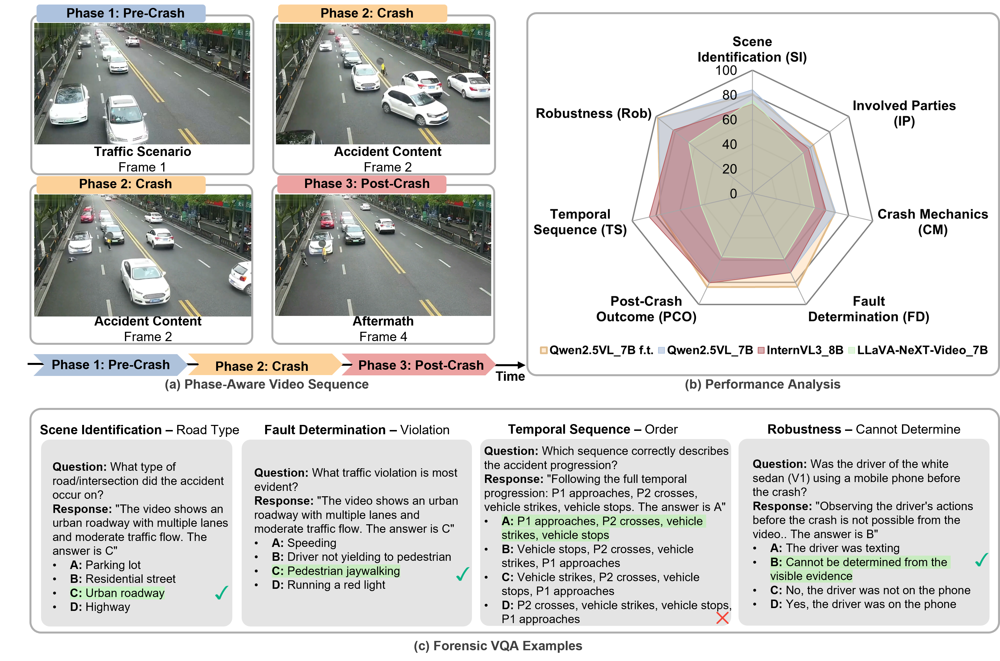

# CrashSight: A Phase-Aware, Infrastructure-Centric Video Benchmark for Traffic Crash Scene Understanding

This repository contains the code, data, and evaluation protocols for **CrashSight**, the first large-scale vision-language benchmark for roadway crash understanding using real-world roadside camera data.

## 🚦 Overview

Cooperative autonomous driving requires traffic scene understanding from both vehicle and infrastructure perspectives. CrashSight bridges the gap in safety-critical scenario evaluation by introducing a benchmark tailored for infrastructure-assisted perception.

* **Dataset:** 250 real-world crash videos from roadside cameras.
* **Annotations:** 13K multiple-choice QA pairs with phase-aware dense captions.
* **Taxonomy:** Two-tier evaluation covering visual grounding (Scene Identification, Involved Parties) and forensic reasoning (Crash Mechanics, Fault Determination, Temporal Sequence).
* **Robustness:** Built-in probes to test hallucination resistance and evidence sufficiency.

## 📊 Key Findings

Our evaluation of 8 state-of-the-art VLM configurations reveals:
* **Domain Adaptation:** Fine-tuning Qwen2.5-VL-7B yields up to a +13.5% average accuracy improvement.
* **Architecture Impact:** InternVL3 demonstrates superior zero-shot temporal ordering capabilities.
* **The Human-AI Gap:** A persistent gap remains in visually demanding categories, indicating that spatial grounding and visual token budgets are the primary bottlenecks for current models.

## 🚀 Quick Start

*(Instructions for environment setup, data downloading, and model inference will be added here.)*

## 📝 Citation

If you find our work useful in your research, please consider citing:
